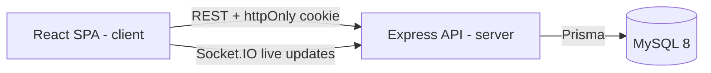
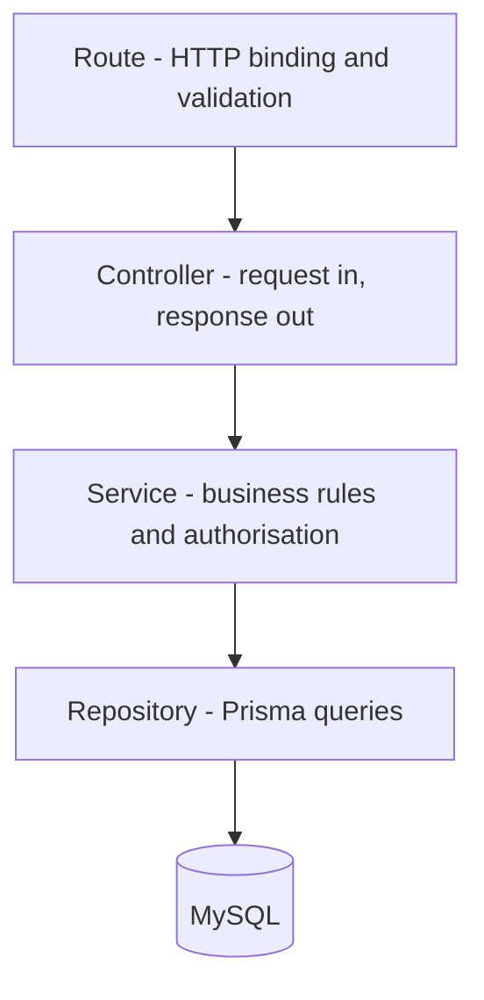
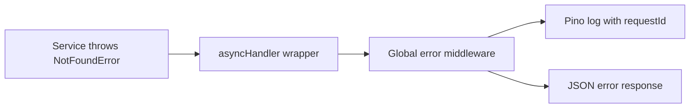

# Architecture

## Overview

The application is a TypeScript monorepo with two workspaces: an Express API
(`server/`) and a React single-page application (`client/`, added in a later
pull request). They share nothing at runtime and communicate only over HTTP and,
for collaborative editing, a WebSocket connection.



## Backend layering

The backend is deliberately split into three layers. The assignment requires
tests for "controllers, services, and data access layers", so those layers exist
as real directories rather than as an idea.



Each layer may only talk to the one directly beneath it:

| Layer          | Responsibility                                                    | Must not                                     |
| -------------- | ----------------------------------------------------------------- | -------------------------------------------- |
| **Route**      | Bind an HTTP path to a controller, run schema validation          | Contain business logic                       |
| **Controller** | Translate HTTP to plain arguments, translate results back to HTTP | Query the database, make authorisation calls |
| **Service**    | Enforce business rules and ownership; throw domain errors         | Know that HTTP exists (no `req`, `res`)      |
| **Repository** | Execute Prisma queries and return plain objects                   | Contain conditional business logic           |

The value of the rule is testability: services are unit-tested with a stubbed
repository, and controllers are integration-tested through Supertest. Neither
test needs the other layer to be real.

## Error handling

No controller sends an error response directly. Every layer throws a subclass of
`AppError`, an async wrapper forwards it to a single Express error-handling
middleware, and that middleware is the only place that decides status codes,
logs the failure through Pino and shapes the response body.



## API response contract

Every endpoint returns one of exactly two shapes, typed in
`server/src/shared/api-response.ts`:

```jsonc
// success
{ "data": { "id": 1, "title": "My note" } }

// failure
{ "error": { "code": "NOT_FOUND", "message": "Note not found", "requestId": "..." } }
```

Clients therefore never have to guess whether a field is present, and the
frontend has a single place to handle failures.

## Directory layout

### `server/`

```text
server/
├── src/
│   ├── config/         Environment loading and validation
│   ├── lib/            Third-party client singletons (Prisma, Pino)
│   ├── middleware/     Cross-cutting Express middleware
│   ├── modules/        Feature slices — one folder per domain concept
│   │   ├── auth/       auth.routes.ts, auth.controller.ts, auth.service.ts …
│   │   └── notes/      notes.routes.ts, notes.controller.ts, notes.service.ts …
│   ├── errors/         AppError hierarchy
│   ├── shared/         Framework-agnostic types and constants
│   ├── app.ts          Express app assembly (exported for Supertest)
│   └── index.ts        Process bootstrap only
└── test/
    ├── unit/           Services and pure logic, with stubbed dependencies
    └── integration/    Full HTTP round trips against a test database
```

Code is grouped by **feature** (`modules/notes/`), not by technical role
(`controllers/`, `services/`). Everything needed to understand notes lives in one
folder, so a change to notes rarely touches more than one directory.

`app.ts` is separate from `index.ts` because Supertest needs the configured
Express application without a listening socket.

### `client/` (added in a later pull request)

```text
client/
├── src/
│   ├── api/            Axios instance and typed endpoint functions
│   ├── components/     Reusable presentational components
│   ├── features/       Feature slices with their own hooks and queries
│   ├── pages/          Route-level screens
│   └── routes/         Router configuration and route guards
```

## Testing strategy

| Kind            | Tool                   | What it covers                                    |
| --------------- | ---------------------- | ------------------------------------------------- |
| Unit (backend)  | Mocha, Chai, Sinon     | Services and pure logic with stubbed repositories |
| Integration     | Mocha, Chai, Supertest | Real HTTP requests against a test database        |
| Unit (frontend) | Jest, Testing Library  | Components and hooks, with the API mocked by MSW  |

Tests are committed in the same pull request as the code they cover, never in a
follow-up. Coverage is reported through `c8` in a format SonarQube can ingest.

## Decision records

Significant decisions are recorded in [`docs/adr/`](./adr/README.md).
